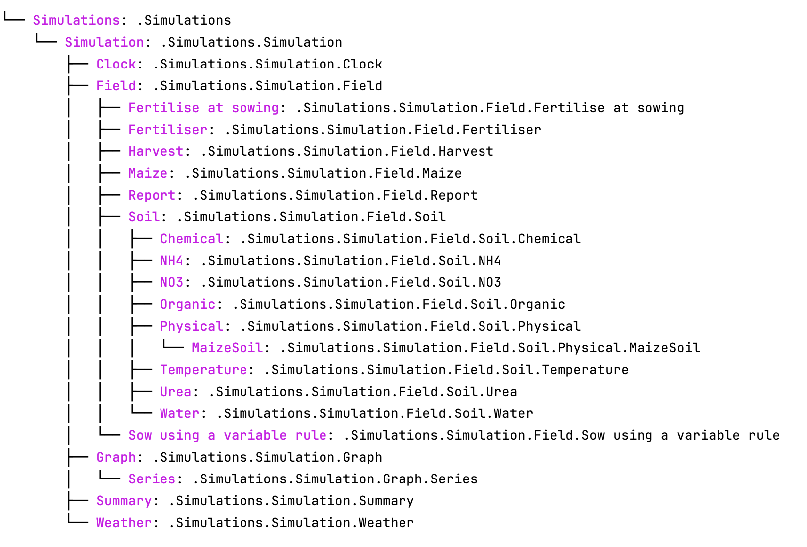

.. _plain_inspect:

Inspect Model
=============================

Most of the time, when modifying model parameters and values, you need the full path to the specified APSIM model.  
This is where the :meth:`~apsimNGpy.core.apsim.ApsimModel.inspect_model` method becomes useful—it allows you to inspect the model without opening the file in the APSIM GUI.

.. hint::
    Models can be inspected either by importing the ``Models`` namespace or by using string paths. The most reliable approach is to provide the full model path—either as a string or as a ``Models`` attribute path.
    However, remembering full paths can be tedious, so allowing partial model names or references can significantly save time during development and exploration.

If you are stranded, check the list below, red color are the modules,
and not allowed in this function and below each module are the model types

.. _model_List:

``Models``:
  - Models.Clock
  - Models.Fertiliser
  - Models.Irrigation
  - Models.Manager
  - Models.Memo
  - Models.MicroClimate
  - Models.Operations
  - Models.Report
  - Models.Summary
``Models.Climate``:
  - Models.Climate.Weather
``Models.Core``:
  - Models.Core.Folder
  - Models.Core.Simulation
  - Models.Core.Simulations
  - Models.Core.Zone
``Models.Factorial``:
  - Models.Factorial.Experiment
  - Models.Factorial.Factors
  - Models.Factorial.Permutation
``Models.PMF``:
  - Models.PMF.Cultivar
  - Models.PMF.Plant
``Models.Soils``:
  - Models.Soils.Arbitrator.SoilArbitrator
  - Models.Soils.CERESSoilTemperature
  - Models.Soils.Chemical
  - Models.Soils.Nutrients.Nutrient
  - Models.Soils.Organic
  - Models.Soils.Physical
  - Models.Soils.Sample
  - Models.Soils.Soil
  - Models.Soils.SoilCrop
  - Models.Soils.Solute
  - Models.Soils.Water
``Models.Storage``:
  - Models.Storage.DataStore
``Models.Surface``:
  - Models.Surface.SurfaceOrganicMatter
``Models.WaterModel``:
  - Models.WaterModel.WaterBalance

Let's take a look at how it works.

.. code-block:: python

         from apsimNGpy.core.core import Models
         from apsimNGpy.core.apsim import ApsimModel

load default ``maize`` module::

    model = ApsimModel(model= 'Maize')

Find the path to all the manager script in the simulation::

     model.inspect_model(Models.Manager, fullpath=True)

.. code-block:: python

     [.Simulations.Simulation.Field.Sow using a variable rule',
     '.Simulations.Simulation.Field.Fertilise at sowing',
     '.Simulations.Simulation.Field.Harvest']

Inspect the full path of the Clock Model::

     model.inspect_model(Models.Clock) # gets the path to the Clock models
     ['.Simulations.Simulation.Clock']

Inspect the full path to the crop plants in the simulation::

     model.inspect_model(Models.Core.IPlant) # gets the path to the crop model
     ['.Simulations.Simulation.Field.Maize']

Or use full string path as follows::

     model.inspect_model(Models.Core.IPlant, fullpath=False) # gets you the name of the crop Models
     ['Maize']
Get full path to the fertiliser model::

     model.inspect_model(Models.Fertiliser, fullpath=True)
     ['.Simulations.Simulation.Field.Fertiliser']

.. Hint::

    The models from APSIM Models namespace are abstracted to use strings. All you need is to specify the name or the full path to the model enclosed in a string as follows::

     model.inspect_model('Clock') # get the path to the clock model
     ['.Simulations.Simulation.Clock']

Alternatively, you can do the following::

     model.inspect_model('Models.Clock')
     ['.Simulations.Simulation.Clock']

Repeat inspection of the plant model while using a ``string``::

     model.inspect_model('IPlant')
     ['.Simulations.Simulation.Field.Maize']

Inspect using full model namespace path::

     model.inspect_model('Models.Core.IPlant')

What about weather model?::

     model.inspect_model('Weather') # inspects the weather module
     ['.Simulations.Simulation.Weather']

Alternative::

     # or inspect using full model namespace path
     model.inspect_model('Models.Climate.Weather')
     ['.Simulations.Simulation.Weather']

Try finding path to the cultivar model::

     model.inspect_model('Cultivar', fullpath=False) # list all available cultivar names

.. code-block:: python

     ['Hycorn_53',  'Pioneer_33M54', 'Pioneer_38H20',  'Pioneer_34K77',
     'Pioneer_39V43',  'Atrium', 'Laila', 'GH_5019WX']

# we can get only the names of the cultivar models using the full string path::

     model.inspect_model('Models.PMF.Cultivar', fullpath = False)

.. code-block:: python

     ['Hycorn_53',  'Pioneer_33M54', 'Pioneer_38H20',  'Pioneer_34K77',
      'Pioneer_39V43',  'Atrium', 'Laila', 'GH_5019WX']

.. hint::

    ``model_type`` can be any of the following classes from the `Models` namespace, and
    can be passed as strings or as full path to Models namespace if Models is imported. See the description about :ref:`model_List`.

.. seealso::

  API description: :meth:`~apsimNGpy.core.apsim.ApsimModel.inspect_model`

.. tip::

    In some cases, determining the model type can be challenging. Fortunately, **apsimNGpy** provides a recursive function to simplify this process—the :meth:`~apsimNGpy.core.apsim.ApsimModel.find_model` method.
    This method helps identify the model type efficiently. However, you need to know the name of the model, such as *Clock* or *Weather*, to use it effectively.

.. code-block:: python

    from apsimNGpy import core
    from apsimNGpy.core.core import Models
    from apsimNGpy.core.apsim import ApsimModel

    # Load the default maize simulation
    model = ApsimModel(model= 'Maize')

    # Inspect or find specific components
    model.find_model("Weather")
    Models.Climate.Weather

    model.find_model("Clock")
    Models.Clock

Whole Model inspection
=====================================

Use :meth:`~apsimNGpy.core.apsim.ApsimModel.inspect_file` method to inspects all simulations in the file. This method displays a tree showing how each model is connected with each other.
``Model Names`` are colored and are followed by their corresponding full paths relative to their parent node; ``Simulations``.

For interactive consoles (e.g., Jupyter Notebook), this is a game changer, you’ll hardly ever need the GUI.

.. code-block:: python

    model.inspect_file(cultivar =False)

.. tip::

  To include cultivar paths to the above simulation tree, use ``cultivar =True`` as shown below. For developers who are testing the method using console = False

.. code-block:: python

    model.inspect_file(cultivar = True)

.. seealso::

  :meth:`~apsimNGpy.core.apsim.ApsimModel.inspect_file` in the :ref:`API Reference <api_ref>`

.. Warning::

    Only a few key model types are inspected using :meth:`~apsimNGpy.core.apsim.ApsimModel.inspect_model` under the hood. Inspecting the entire simulation file can produce a large volume of data, much of which may not be relevant or necessary in most use cases.

    If certain models do not appear in the inspection output, this is intentional — the tool selectively inspects components to keep results concise and focused.

    For a complete view of the entire model structure, we recommend opening the simulation file in the APSIM GUI using :meth:`apsimNGpy.core.apsim.ApsimModel` method

.. seealso::

   - :ref:`API Reference <api_ref>`
   - :ref:`inspect_params`
