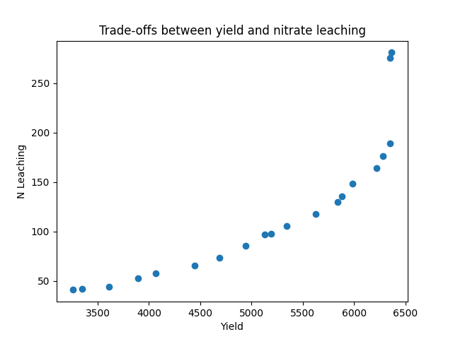

Multi-Objective Optimization with apsimNGpy
============================================

This tutorial demonstrates how to perform multi-objective optimization on an APSIM Next Generation model using the `apsimNGpy.optimizer.moo` module. You will learn two ways to specify decision variables and how to run an evolutionary optimization algorithm using `pymoo`.
This approach enables you to explore trade-offs between objectives like crop yield and environmental outcomes.

.. admonition:: Prerequisites

    Make sure you have the following installed and configured:
    * **APSIM Next Generation**
    * **Python 3.10+**
    * **apsimNGpy** package (latest version)
    * Python packages: ``pymoo``, ``matplotlib``, ``numpy``, and ``pandas``

Step 1: Import Required Modules
^^^^^^^^^^^^^^^^^^^^^^^^^^^^^^^

.. code-block:: python

    from apsimNGpy.optimizer.moo import ApsimOptimizationProblem, Runner, compute_hyper_volume, NSGA2
    from pymoo.optimize import minimize
    import matplotlib.pyplot as plt

.. admonition:: Interpretation

    * ``Runner```: handles model simulation and editing
    * ``ApsimOptimizationProblem``: wraps your problem setup for `pymoo`
    * ``NSGA2``: a multi-objective genetic algorithm
    * ``minimize``: pymoo's driver for optimization

Step 2: Initialize the APSIM Model Runner
^^^^^^^^^^^^^^^^^^^^^^^^^^^^^^^^^^^^^^^^^

You create a runner tied to a specific `.apsimx` model file. This runner manages simulation and parameter editing.
Here, I a using the default maize template. Because it does not have nitrate leaching in its Report table, I have also added it.

.. code-block:: python

    runner = Runner("Maize")
    runner.add_report_variable('[Soil].Nutrient.NO3.kgha[1] as nitrate', report_name='Report')


Step 3: Define Objective Functions
^^^^^^^^^^^^^^^^^^^^^^^^^^^^^^^^^^

Objective functions take APSIM output (as a DataFrame) and return scalar values. You can define any number of such functions depending on the goals.
If you have 3 objectives, then we expect 3 functions.

.. important::

   Maximization objectives must be converted into minimization form by negating them (e.g., ``-f(x)``), since the underlying optimization algorithms are designed to minimize objective functions.


.. code-block:: python

    def maximize_yield(df):
        return -df['Yield'].mean()

    def minimize_nitrate_leaching(df):
        return df['nitrate'].sum()


Step 4a: Define Decision Variables (Approach 1 - Direct List)
^^^^^^^^^^^^^^^^^^^^^^^^^^^^^^^^^^^^^^^^^^^^^^^^^^^^^^^^^^^^^

You can directly supply a list of variables to optimize as follows:.

.. code-block:: python

    decision_vars = [
        {'path': '.Simulations.Simulation.Field.Fertilise at sowing',
         'Amount': "?", 'bounds': [50, 300], 'v_type': 'float'},

        {'path': '.Simulations.Simulation.Field.Sow using a variable rule',
         'Population': "?", 'bounds': [4, 14], 'v_type': 'float'}
    ]
    # initialise the problem
    problem = ApsimOptimizationProblem(runner, objectives=[maximize_yield, minimize_nitrate_leaching], decision_vars=decision_vars)


Each dictionary defines:

* ``path``: the APSIM model path to the component.
* ``Amount`` / `Population`: the parameter to be optimized (denoted by '?').
* ``bounds``: lower and upper bounds for the optimizer.
* ``v_type``: variable type.

.. note::

   Each decision variable specification must contain exactly one parameter marked with ``'?'``. This signifies the target parameter to be optimized during the calibration or search process.


Step 3b: Define Decision Variables (Approach 2 - Using ``.add_parameters()``)
^^^^^^^^^^^^^^^^^^^^^^^^^^^^^^^^^^^^^^^^^^^^^^^^^^^^^^^^^^^^^^^^^^^^^^^^^^^^^^

Instead of a list, you can add each parameter one at a time.
There is a need to initiate our problem with objectives only, then add control variables on the fly.

.. code-block:: python

    # initialise the problem
    problem = ApsimOptimizationProblem(runner, objectives=[maximize_yield, minimize_nitrate_leaching])

    problem.add_parameters(
        path='.Simulations.Simulation.Field.Fertilise at sowing',
        Amount='?', bounds=[50, 300], v_type='float')

    problem.add_parameters(
        path='.Simulations.Simulation.Field.Sow using a variable rule',
        Population='?', bounds=[4, 14], v_type='float')

The best approach depends on the user's preference, but the last approach helps the user to focus on one control variables required details at a time

Step 5: Run the NSGA-II Optimizer
^^^^^^^^^^^^^^^^^^^^^^^^^^^^^^^^^^^^^

``NSGA-II`` is a commonly used algorithm for multi-objective problems. There are other genetic multi-objective algorithms, but for trade-off analysis with APSIM,
``NSGA-II`` is more than adequate. You can now run  it as follows:

.. code-block:: python

    algorithm = NSGA2(pop_size=20)

    result = minimize(
        problem.get_problem(),
        algorithm,
        ('n_gen', 10),
        seed=1,
        verbose=True
    )


* ``pop_size``: number of candidate solutions per generation.
* ``n_gen``: number of generations to run.

Step 6: Plot the Pareto Front
^^^^^^^^^^^^^^^^^^^^^^^^^^^^^^^^

The results show trade-offs between competing objectives. You can visualize them:

.. code-block:: python

    F = result.F
    plt.scatter(F[:, 0]* -1, F[:, 1])
    plt.xlabel("Yield")
    plt.ylabel("N Leaching")
    plt.title("Pareto Front")
    plt.show()



## Step 7: Compute Hyper volume (Optional)

The hyper volume gives a scalar metric of solution quality, and can be useful if you want to explore the best inputs such as population size, max_gen.

.. code-block:: python

    hv = compute_hyper_volume(F, normalize=True)
    print("Hyper volume:", hv)


